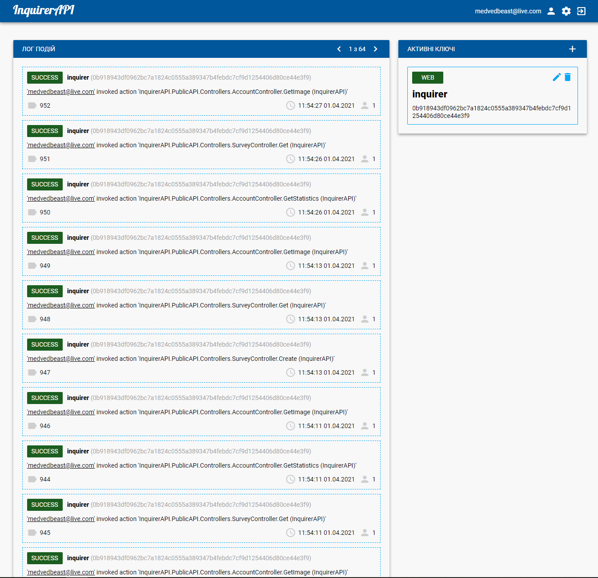
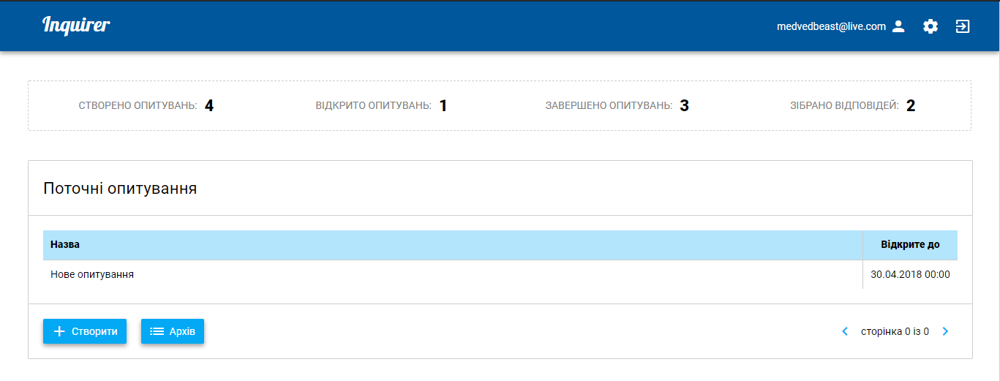
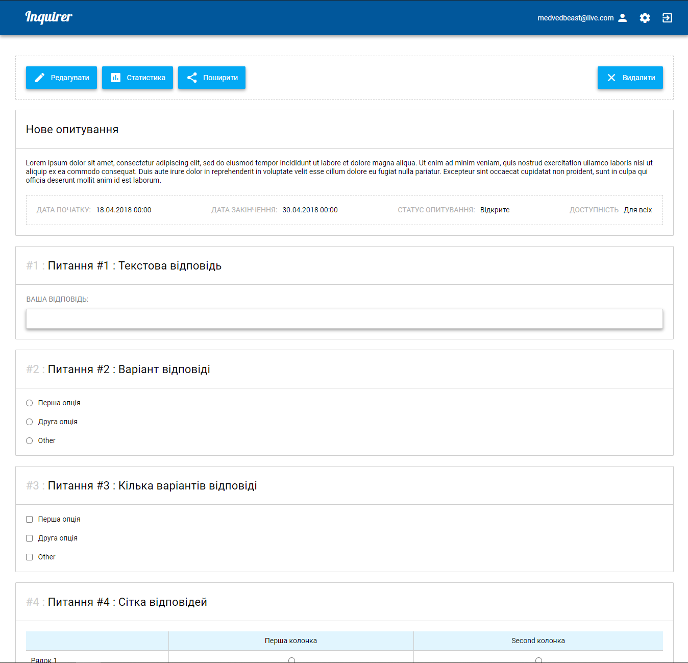
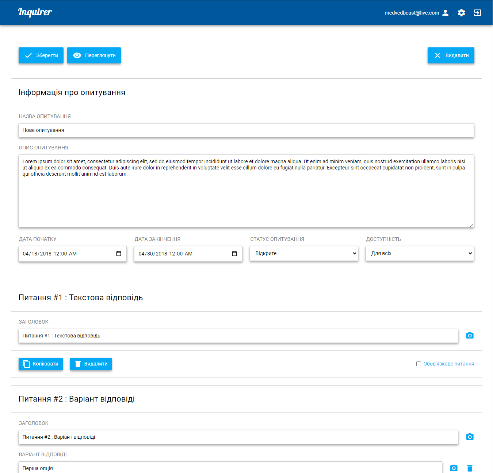
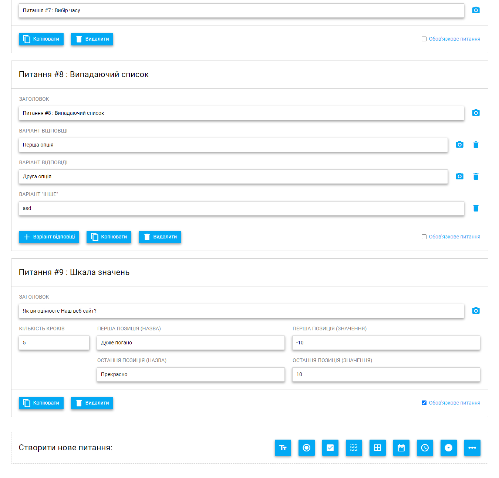
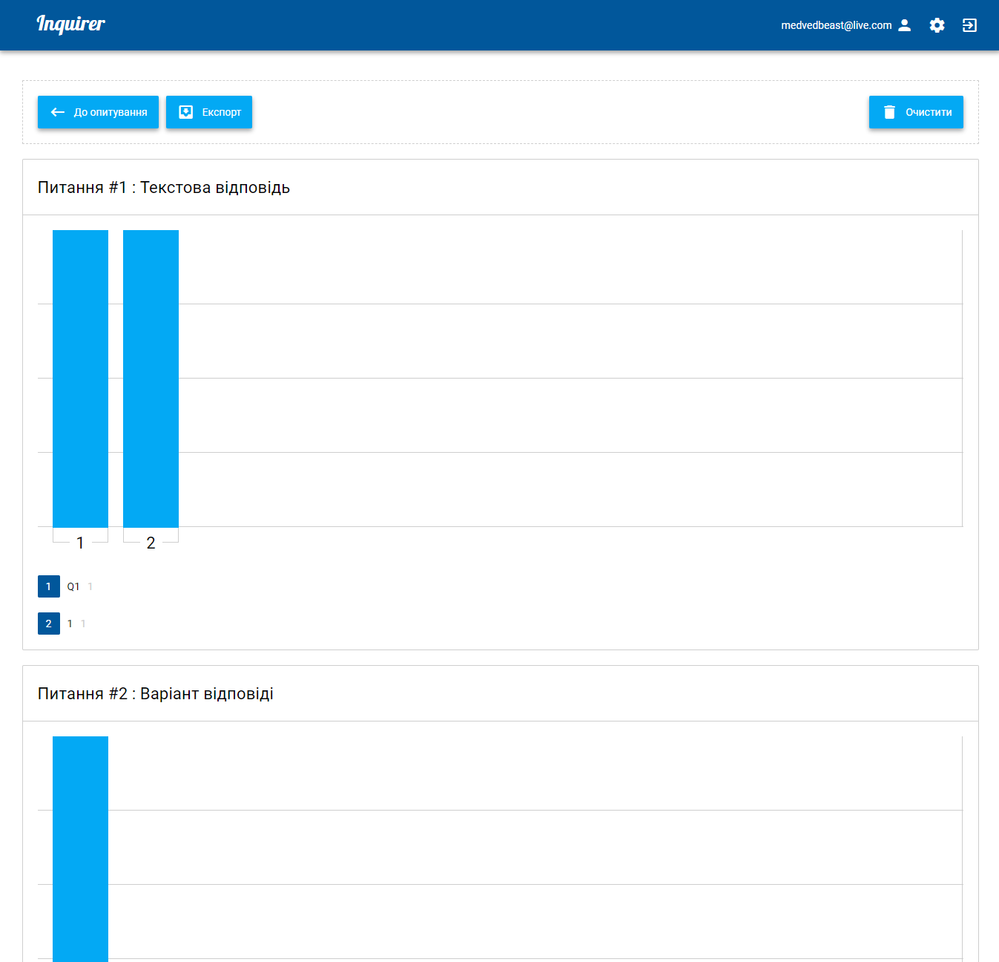

# Inquirer
Inquirer web-client and web-service based public API

Solution contains web-client, web-service & web-site for API management.

Technologies used: ASP.NET Core 2.0 + Vue.JS. 

<b>API log page:

Inquirer main page:

Inquirer poll page:

Inquirer poll edit page (start):

Inquirer poll edit page (end):

Inquirer poll statistics page:</b>

